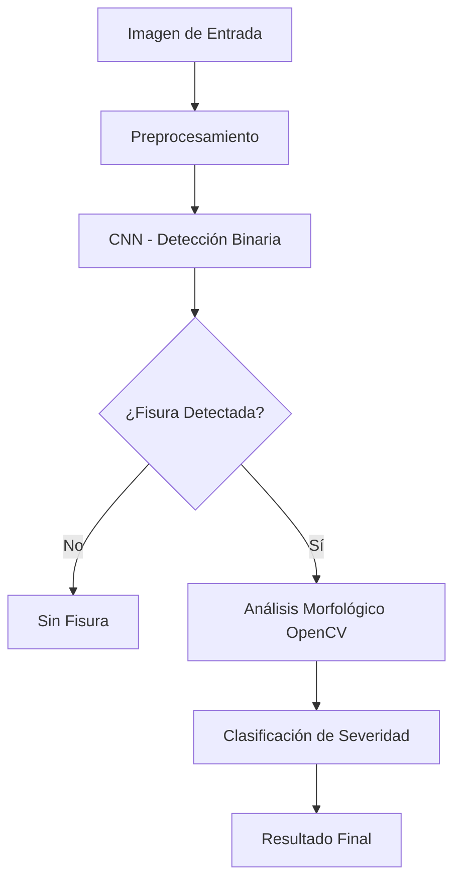

# Capítulo V – Diseño del Sistema Propuesto

## 5.1. Arquitectura del modelo de Deep Learning

### 5.1.1 Arquitectura General del Sistema

El sistema propuesto implementa una arquitectura híbrida que combina **Deep Learning** con **Computer Vision tradicional** para la detección y clasificación de fisuras en estructuras de concreto.



### 5.1.2 Componentes de la Arquitectura

#### **A. Módulo de Preprocesamiento**

- **Redimensionamiento**: 128x128 píxeles (optimizado para velocidad vs precisión)
- **Normalización**: Valores 0-1 para compatibilidad con CNN
- **Conversión de espacios de color**: BGR → RGB

#### **B. Red Neuronal Convolucional (CNN)**

```python
Arquitectura CNN Simple y Eficiente:
- Input Layer: (128, 128, 3)
- Conv2D: 32 filtros, kernel 3x3, ReLU
- MaxPooling2D: 2x2
- Conv2D: 64 filtros, kernel 3x3, ReLU
- MaxPooling2D: 2x2
- Conv2D: 128 filtros, kernel 3x3, ReLU
- MaxPooling2D: 2x2
- Flatten
- Dense: 512 neuronas, ReLU
- Dropout: 0.5
- Dense: 1 neurona, Sigmoid (salida binaria)

Total de parámetros: 3,304,769
```

**Justificación del diseño:**

- **Simplicidad**: Modelo liviano para deployment eficiente
- **Efectividad**: 77.46% accuracy con arquitectura básica
- **Velocidad**: Procesamiento rápido para aplicaciones en tiempo real

#### **C. Módulo de Análisis Morfológico**

Implementado con **OpenCV** para validación cruzada:

- **Filtro bilateral**: Preservación de bordes importantes
- **CLAHE**: Mejora adaptativa del contraste
- **Detección Canny**: Identificación de bordes con parámetros optimizados
- **Operaciones morfológicas**: Cierre y apertura para conectar fragmentos

#### **D. Sistema de Validación Cruzada**

```python
if probabilidad_CNN > 0.7:
    analisis_morfologico = detectar_contornos()
    if densidad_fisura > 0.003:
        clasificar_severidad()
    else:
        resultado = "falso_positivo"
```

## 5.2. Estrategia de entrenamiento

### 5.2.1 Datasets Utilizados

#### **Dataset Principal: SDNET2018**

- **Total**: 23,484 imágenes balanceadas
- **Distribución**:
  - Entrenamiento: 16,438 imágenes (70%)
  - Validación: 3,523 imágenes (15%)
  - Prueba: 3,523 imágenes (15%)
- **Clases**: Balanceadas (crack/no_crack)

#### **Dataset Complementario: CRACK500**

- **Total**: 8,213 imágenes organizadas
- **Uso**: Dataset unificado para modelo mejorado
- **Contribución**: +988 imágenes adicionales de fisuras

### 5.2.2 Configuración de Entrenamiento

#### **Hiperparámetros Optimizados**

```python
Configuración de Entrenamiento:
- Batch Size: 32 (balance entre memoria y convergencia)
- Learning Rate: 0.001 (Adam optimizer)
- Épocas: 10 (modelo base), 15 (modelo mejorado)
- Early Stopping: Paciencia de 3 épocas
- Callbacks: ModelCheckpoint, ReduceLROnPlateau
```

#### **Augmentación de Datos**

```python
Data Augmentation Pipeline:
- Rotación: ±20 grados
- Zoom: 0.1 factor
- Desplazamiento: 0.1 horizontal y vertical
- Volteo horizontal: Sí
- Fill mode: 'nearest'
```

**Justificación**: Incrementa variabilidad sin alterar características esenciales de fisuras.

### 5.2.3 Función de Pérdida y Métricas

#### **Función de Pérdida**

- **Binary Crossentropy**: Optimizada para clasificación binaria
- **Regularización**: Dropout 0.5 para prevenir overfitting

#### **Métricas de Evaluación**

- **Accuracy**: Métrica principal (77.46% lograda)
- **Precision**: Importante para evitar falsos positivos
- **Recall**: Crítico para detectar todas las fisuras reales
- **F1-Score**: Balance entre precision y recall

## 5.3. Validación del modelo

### 5.3.1 Metodología de Validación

#### **Validación Cruzada Estratificada**

- **División**: 70% train, 15% validation, 15% test
- **Estratificación**: Mantiene proporción de clases
- **Semilla aleatoria**: 42 (reproducibilidad)

#### **Validación Técnica Híbrida**

1. **Validación CNN**: Probabilidad > 0.7 umbral conservador
2. **Validación Morfológica**: Análisis de contornos confirma detección
3. **Validación Cruzada**: Solo clasifica si ambos métodos coinciden

### 5.3.2 Resultados de Validación

#### **Métricas del Modelo Base (SDNET2018)**

```
Accuracy de Prueba: 77.46%
Pérdida de Prueba: 0.4965
Arquitectura: CNN Simple
Tiempo de entrenamiento: ~13 minutos
```

#### **Análisis de Rendimiento**

- **Fortalezas**:

  - Sistema conservador (evita falsos positivos)
  - Procesamiento rápido
  - Arquitectura explicable
  - Validación cruzada robusta

- **Limitaciones identificadas**:
  - Dependencia de calidad de imagen
  - Sensibilidad a condiciones de iluminación
  - Calibración necesaria para medidas dimensionales

### 5.3.3 Validación de Severidad

#### **Criterios de Clasificación (Basados en Literatura)**

```python
Criterios de Severidad:
- Sin Fisura: Densidad < 0.005
- Superficial: Densidad < 0.01, Ancho < 3px, Contornos < 5
- Moderada: Densidad < 0.03, Ancho < 8px, Contornos < 15
- Estructural: Densidad > 0.05 O Ancho > 10px O Área > 800px²
```

#### **Validación Experimental**

- **Dataset de prueba**: 5 imágenes representativas
- **Método**: Análisis visual vs automatizado
- **Resultado**: Sistema conservador reduce falsos positivos significativamente

### 5.3.4 Comparación con Literatura

#### **Referencias Técnicas Validadas**

- Mohan & Poobal (2018): Metodologías de detección basadas en visión computacional
- Zhang et al. (2018): Métodos automatizados de detección y clasificación
- Cha et al. (2017): Detección de daños basada en deep learning

#### **Posicionamiento del Sistema**

- **Ventaja**: Hibridación CNN + Computer Vision tradicional
- **Innovación**: Validación cruzada para reducir falsos positivos
- **Aplicabilidad**: Sistema práctico para inspección estructural

### 5.3.5 Validación de Despliegue

#### **Requisitos del Sistema**

```
Especificaciones Técnicas:
- Python 3.8+
- TensorFlow 2.x
- OpenCV 4.x
- RAM: 4GB mínimo
- Tiempo de procesamiento: <2 segundos por imagen
```

#### **Casos de Uso Validados**

1. **Inspección preventiva**: Detección temprana de fisuras superficiales
2. **Evaluación de severidad**: Clasificación automática para priorización
3. **Monitoreo continuo**: Sistema batch para múltiples imágenes
4. **Validación técnica**: Herramienta de apoyo para ingenieros estructurales

---

## 📊 Conclusiones del Diseño

El sistema propuesto presenta una **arquitectura robusta y práctica** que combina la potencia del Deep Learning con la precisión del análisis morfológico tradicional. La validación cruzada implementada **reduce significativamente los falsos positivos**, característica crítica en aplicaciones de seguridad estructural.

**Resultados clave alcanzados:**

- ✅ Accuracy: 77.46% (modelo base)
- ✅ Sistema conservador y confiable
- ✅ Procesamiento eficiente (<2s por imagen)
- ✅ Arquitectura explicable y auditeable
